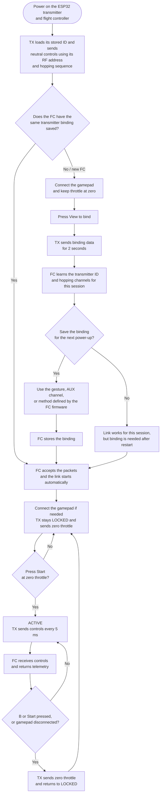

# Silverware TX

ESP32 transmitter firmware for Silverware/Bayang drones using an Xbox gamepad through Bluepad32 and an NRF24L01+ radio.

## Runtime design

- A priority-5 control/RF task on core 1 runs every 5 ms. It exclusively owns controller snapshots, button edges, safety state, Bayang packet generation, hopping, SPI, and telemetry.
- Bluetooth and the ESP main task run on core 0.
- A priority-1 console task consumes immutable snapshots and bounded event records. Slow UART output cannot block RF.
- `LOCKED`, `WAIT_GAMEPAD`, and `GAMEPAD_FAILSAFE` continuously transmit centered, zero-throttle controls. A recovered controller always returns to `LOCKED` and needs a new Start press.
- Radio initialization failure or three consecutive TX failures latches `RADIO_ERROR` until reboot.

Telemetry requires the Bayang header and application checksum. A valid sample is `Fresh` for 500 ms, then `Stale`; its last value and age remain visible for diagnostics. Silverware telemetry does not carry XN297 hardware CRC, so hardware CRC remains disabled.

## How to connect and fly



### How binding is remembered

- The transmitter stores its own ID in ESP32 NVS.
- While locked or waiting for a gamepad, the TX continuously sends centered, zero-throttle controls using the RF address and hopping sequence derived from its stored TX ID.
- If the FC has the same binding saved, it recognizes and accepts those packets immediately. You do not need to press View again.
- A bind packet gives the FC the transmitter ID and hopping channels, allowing the link to work for the current session.
- Silverware does not automatically make a new binding permanent. Saving depends on the specific FC code and configuration, such as a stick gesture, AUX channel, or another firmware-defined action.
- If the FC binding is not saved, repeat the binding procedure after the FC restarts.
- Bind again after replacing the FC, clearing the FC binding, or resetting/changing the transmitter ID.
- Binding does not arm the drone. After binding, the transmitter returns to `LOCKED`; press Start at zero throttle to arm.

For safety, controller loss sends zero throttle within one 5 ms cycle. Reconnecting the controller returns to `LOCKED` and never rearms automatically. A radio hardware failure enters `RADIO_ERROR` and requires a reboot.

## Hardware

- ESP32-WROOM-32 / DevKit V1
- NRF24L01+ on VSPI:
  - MOSI: GPIO 23
  - MISO: GPIO 19
  - SCK: GPIO 18
  - CSN: GPIO 5
  - CE: GPIO 17

Power the NRF24 from a clean 3.3 V source with local decoupling.

## Xbox controls

- Left stick up: throttle; center and below are zero throttle
- Left stick left/right: yaw
- Right stick: pitch and roll
- Start: arm from `LOCKED` at idle throttle; Start while active disarms
- View: bind from `LOCKED` at idle throttle
- B: immediate local disarm
- A: flip
- X: inverted/turtle mode

## Reproducible development setup

The project uses ESP-IDF 5.5.5 through the pinned PIO Arduino platform and declares Arduino-ESP32 3.3.11 through the IDF Component Manager. `dependencies.lock` is committed; generated `managed_components/` content is not.

```sh
pio test -e native
pio run -e esp32dev
```

The firmware build must work from a clean checkout without a local `components/arduino` symlink.
