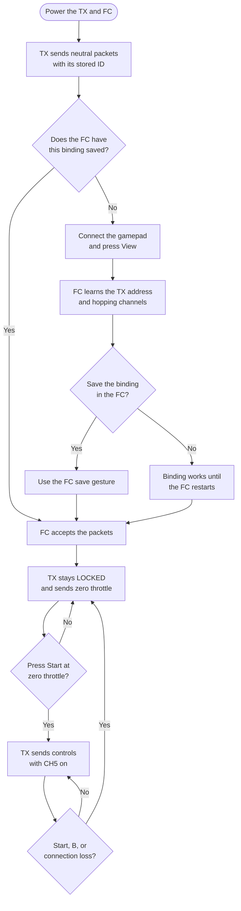

# Binding

[Project overview](../README.md)

Binding gives the FC the TX address and RF hopping channels. It does not arm the FC.

## Connection flow

## Make a new binding

> [!WARNING]
> Remove all propellers before you start this procedure.

1. Power the TX and FC.
2. Connect the gamepad to the TX.
3. Set the throttle to zero.
4. Make sure that the TX shows `LOCKED`.
5. Press View.
6. Wait for the two-second bind period to finish.

The TX sends a Bayang A3 bind packet. A3 enables telemetry and does not enable analog AUX channels.

The FC learns the TX address and hopping channels. The TX then returns to `LOCKED`.

The new binding works for the current FC power session. Silverware does not save it automatically.

## Save the binding in the Rajawali FC

The Rajawali firmware uses `Up-Up-Up` to enable binding storage. It uses `Down-Down-Down` to save data to flash.

The TX supplies a safe gesture mode while it is `LOCKED`. This mode passes only the right-stick pitch value.

1. Make sure that the TX shows `LOCKED`.
2. Press and hold L3.
3. Hold the right stick at center for at least 0.7 seconds.
4. Move the right stick up for 0.1 to 0.5 seconds.
5. Return the right stick to center.
6. Repeat steps 4 and 5 two more times.
7. Hold the right stick at center for at least 0.7 seconds.
8. Move the right stick down for 0.1 to 0.5 seconds.
9. Return the right stick to center.
10. Repeat steps 8 and 9 two more times.
11. Release L3.
12. Restart the FC and check the automatic connection.

L3 gesture mode keeps throttle at zero. It also keeps CH5 and all AUX channels off.

## Saved binding behavior

The TX stores its transmitter ID in ESP32 NVS. The FC stores the learned address and hopping channels in its flash.

At startup, the TX sends neutral packets with its stored ID. A correctly saved FC accepts these packets without a new bind.

Bind again after one of these changes:

- You replace the FC.
- You erase the FC flash.
- You clear the FC binding.
- You reset or change the TX ID.

If the FC does not connect after a restart, repeat the bind and save procedures.
